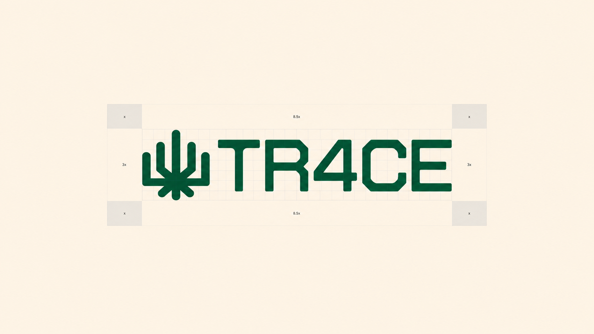
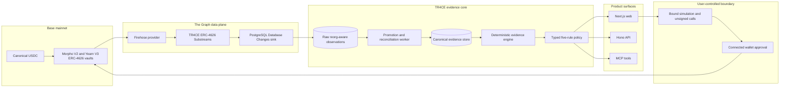

<p align="center">
  
</p>

# TR4CE

<p align="center">
  <strong>Verifiable ERC-4626 vault evidence for people, wallets, and agents.</strong>
</p>

TR4CE turns Base mainnet vault activity into reproducible evidence reports, evaluates each report against an explicit five-rule policy, and prepares transactions that only the connected wallet owner can approve.

<p align="center">
  <a href="https://tr4ce.vercel.app"><strong>Live application</strong></a> ·
  <a href="https://tr4ce.vercel.app/search">Explore evidence</a> ·
  <a href="https://tr4ce.vercel.app/reports/gauntlet-usdc-prime">Report specimen</a> ·
  <a href="apps/api/openapi.json">OpenAPI</a>
</p>

> Built for [ETHOnline 2026](https://ethglobal.com/events/ethonline2026).

## AI use disclosure

AI was used as a supervised execution and research assistant for bounded implementation, technical research, debugging, documentation, and review tasks. It was not used for unsupervised end-to-end project development.

The product concept, architecture, policy semantics, evidence requirements, integration choices, wallet approvals, deployment ownership, source review, and release decisions remained human-directed. Every material output was reviewed and approved by the project team.

## Why TR4CE

An ERC-4626 interface tells you how to call a vault. It does not tell you whether a claim about that vault is complete, current, reproducible, or relevant to your policy.

Vault comparison commonly collapses important distinctions:

- historical observations become promises about future yield;
- missing data becomes a clean-looking zero;
- a ticker symbol stands in for verified token identity;
- policy decisions lose the block and inputs that produced them;
- transaction preparation is presented as if an agent executed it;
- interface compliance is mistaken for identical vault behavior.

TR4CE keeps the chain of reasoning intact. Every conclusion retains its vault, chain, block, observation window, formula inputs, policy version, reason codes, provenance, and limitations.

## What TR4CE does

1. **Traces standardized vault activity.** A reusable Substreams package normalizes ERC-4626 deposits, withdrawals, share transfers, and block-scoped vault snapshots.
2. **Builds immutable evidence.** Historical observations and current contract reads are assembled without silently replacing missing facts.
3. **Evaluates an explicit policy.** Five typed rules return `PASS`, `FAIL`, or `UNKNOWN` through deterministic code.
4. **Serves people and agents.** The same versioned contract is exposed through the web application, HTTP API, MCP server, and public agent skill.
5. **Prepares, but never executes.** TR4CE builds exact calldata and binds simulation to the chain, account, target, value, calldata, block, and capability version.
6. **Leaves signing with the owner.** No TR4CE service accepts a private key, signs a transaction, or submits one on a user's behalf.

## Base mainnet evidence

TR4CE is grounded in real Base mainnet evidence. The committed manifest records four USDC-denominated ERC-4626 vaults across Morpho V2 and Yearn V3. Each record includes deployed code identity, latest and historical capability probes, a shared seven-day observation window, and an observed flow transaction.

TR4CE does **not** receive or custody Base USDC. It traces public onchain activity and prepares unsigned actions. The tokens shown in the evidence below moved between external users, protocols, and vault contracts.

| Evidence | Verified reference |
| --- | --- |
| Network | [Base mainnet, chain ID 8453](https://basescan.org) |
| Canonical asset | [Native USDC `0x8335...2913`](https://basescan.org/token/0x833589fCD6eDb6E08f4c7C32D4f71b54bdA02913) |
| Evidence manifest | [`packages/test-vaults/src/manifest.json`](packages/test-vaults/src/manifest.json) |
| Verification block | [Base block `50,879,441`](https://basescan.org/block/50879441) |
| Morpho flow proof | [Successful Base transaction with 104.830062 USDC deposited into Gauntlet USDC Prime](https://basescan.org/tx/0xc21c094783f3f466b48f65867d1e6248b2c1740c7730f29a78e15d21c6c18752) |
| Yearn flow proof | [Successful Base transaction depositing 9.602337 USDC into USDC Horizon yVault](https://basescan.org/tx/0xfa93060962f2d107e616873bf0becc7f0d77af7ca5d027cbb6cfe0a068bcffb2) |
| Cross-vault flow proof | [Successful Base transaction involving Yearn and Morpho vault positions](https://basescan.org/tx/0x33d187b5c8b87150aff088ddaef4954aa12f8e4ea1d176f61f75ee4080e7d1d6) |

### Curated vault set

| Vault | Adapter | Base address | Recorded evidence |
| --- | --- | --- | --- |
| Gauntlet USDC Prime, `gtUSDCp` | Morpho V2 | [`0xeE8F...4b61`](https://basescan.org/address/0xeE8F4eC5672F09119b96Ab6fB59C27E1b7e44b61) | Code hash, 18 latest and historical probes, flow transaction |
| Yearn OG USDC, `ymvOG-USDC` | Morpho V2 | [`0xef41...5D03`](https://basescan.org/address/0xef417a2512C5a41f69AE4e021648b69a7CdE5D03) | Code hash, 18 latest and historical probes, flow transaction |
| Morpho Yearn Vault 1 Compounder, `ysUSDC` | Yearn V3 | [`0xF115...0D9f`](https://basescan.org/address/0xF115C134c23C7A05FBD489A8bE3116EbF54B0D9f) | Proxy and implementation code hashes, 18 latest and historical probes, flow transaction |
| USDC Horizon yVault, `yvUSDC-H` | Yearn V3 | [`0xc3BD...62a9`](https://basescan.org/address/0xc3BD0A2193c8F027B82ddE3611D18589ef3f62a9) | Code hash, 18 latest and historical probes, flow transaction |

The manifest was recorded from live chain reads on 6 September 2026. Its evidence is versioned source material, not a claim that current balances, limits, or market conditions remain unchanged.

## How it works



### Evidence path

1. Substreams reads Base blocks and filters the curated vault set before expensive decoding and contract calls.
2. The package emits typed deposits, withdrawals, share transfers, and vault snapshots.
3. The PostgreSQL sink keeps raw cursor and pre-confirmation undo behavior.
4. The worker promotes confirmed observations and invalidates affected evidence if a deep reorganization is detected.
5. The evidence engine selects a block-pinned window and performs exact calculations.
6. The policy engine evaluates every rule and keeps the evidence references attached.
7. Web, API, and MCP clients receive the same versioned result.

### Action path

1. A user requests a deposit or redeem preview.
2. TR4CE verifies the chain, account, vault, asset, and capability profile.
3. The chain adapter builds exact calldata and simulates it against a named block.
4. TR4CE returns unsigned calls, simulation output, expiry, and limitations.
5. The connected wallet displays the request for explicit approval.
6. Only the wallet can sign and submit the transaction.
7. TR4CE may record a caller-supplied transaction hash and inspect its receipt. It never submits the transaction itself.

## Five rules, three honest outcomes

A TR4CE policy evaluates:

| Rule | Question |
| --- | --- |
| Underlying asset | Is the vault backed by the required canonical asset? |
| Minimum history | Does verified evidence cover the required period? |
| Minimum TVL | Did vault-reported total assets meet the threshold at the report block? |
| Observed share-value return | Did backward-looking share conversion meet the configured floor? |
| Withdrawable assets | Could the observed account withdraw the required amount at the named block? |

Outcome precedence is deterministic:

- any required `FAIL` makes the overall result `FAIL`;
- otherwise, any required `UNKNOWN` makes the overall result `UNKNOWN`;
- only five `PASS` results produce an overall `PASS`.

`UNKNOWN` is not an error state to hide. It is the correct result for missing, stale, reverted, incompatible, or semantically unsupported evidence.

## Product surfaces

### Web application

The [live application](https://tr4ce.vercel.app) provides vault discovery, evidence comparison, policy editing, report dossiers, simulation review, and explicit wallet handoff.

The public [report specimen](https://tr4ce.vercel.app/reports/gauntlet-usdc-prime) demonstrates the complete report format. It is deliberately labeled illustrative and is not represented as a live provider query.

### HTTP API

The Hono API exposes versioned routes for:

- vault discovery;
- immutable evidence reports;
- typed policy evaluation;
- deposit and redeem preparation;
- simulation-bound action state;
- caller-reported transaction receipt inspection.

The checked-in [`OpenAPI document`](apps/api/openapi.json) is protected by a drift test against the runtime contract.

### MCP server

TR4CE provides six typed agent tools:

| Tool | Purpose | Onchain effect |
| --- | --- | --- |
| `search_vaults` | Discover verified vault identities and capabilities | None |
| `get_evidence` | Retrieve an immutable evidence report | None |
| `evaluate_policy` | Evaluate the five typed rules | None |
| `prepare_deposit` | Build exact unsigned approval and deposit calls | None |
| `prepare_redeem` | Build an exact unsigned redeem call | None |
| `get_action_status` | Inspect status for a caller-supplied transaction hash | None |

The public [`skill/SKILL.md`](skill/SKILL.md) teaches compatible agents how to use these tools without confusing preparation with execution.

## Sponsor integration: The Graph

The Graph is a load-bearing data plane, not a logo placement.

- TR4CE ships a reusable protocol-neutral ERC-4626 Substreams package for Base.
- It normalizes `Deposit`, `Withdraw`, `ShareTransfer`, and block-scoped `VaultSnapshot` messages.
- Vault addresses are runtime parameters, so another operator can trace a different curated set without rebuilding the WASM package.
- The package emits the official PostgreSQL Database Changes type for reorg-aware sinking.
- The repository includes deterministic fixtures and a live pinned-block verification script.
- Research recorded in the package README found no existing generic ERC-4626 Substreams package spanning Morpho V2 and Yearn V3 on Base.

See [`substreams/erc4626/README.md`](substreams/erc4626/README.md) for the module contract, registry search, quick start, and verification evidence.

## Security and custody boundaries

- No private key enters the web, API, MCP, worker, or database.
- No server component can sign or submit a transaction.
- The read-only product works without a connected wallet.
- Canonical asset identity uses chain ID and address, never ticker text alone.
- Token amounts remain integer base units until presentation.
- Financial policy decisions do not use native floating-point arithmetic.
- Deposit approval is exact amount only when approval is required.
- Simulations expire after three blocks or 60 seconds.
- A chain, account, amount, target, calldata, value, block, or capability change invalidates the prepared action.
- Missing or contradictory evidence becomes `UNKNOWN`, never a guessed success.

TR4CE deploys no custom custody contract. It works with existing ERC-4626 vault contracts and keeps every state-changing action inside the user's wallet.

## Repository map

| Path | Responsibility |
| --- | --- |
| `apps/web/` | Next.js evidence interface and wallet handoff |
| `apps/api/` | Hono HTTP API and generated OpenAPI contract |
| `apps/mcp/` | Typed MCP evidence and action-preparation tools |
| `apps/worker/` | Confirmed-row promotion and deep-reorg reconciliation |
| `packages/domain/` | Versioned schemas, identifiers, and shared contracts |
| `packages/evidence/` | Pure exact calculations and report assembly |
| `packages/policy/` | Policy schema, validation, and deterministic evaluation |
| `packages/chain/` | ERC-4626 reads, calldata, simulation, and receipts |
| `packages/db/` | PostgreSQL schema, migrations, and repositories |
| `packages/test-vaults/` | Curated Base vault manifest and onboarding evidence |
| `substreams/erc4626/` | Rust Substreams modules, protobuf, SQL output, and fixtures |
| `skill/` | Public provider-neutral agent usage contract |
| `evals/` | Fixed prompts and rubric for agent evaluation |
| `docs/technical/` | Architecture, data model, integrations, and security decisions |

## Local development

### Requirements

- Node.js `>=22 <25`
- pnpm `10.33.2` through Corepack
- Docker Desktop or Docker Engine for local PostgreSQL
- Rust stable, the `wasm32-unknown-unknown` target, and Substreams CLI for indexer work

### Install

```bash
git clone https://github.com/0xlann/tr4ce-app.git
cd tr4ce-app
corepack enable
pnpm install --frozen-lockfile
cp .env.example .env
```

Never commit provider credentials, database URLs, wallet secrets, private keys, or service-role keys.

### Start PostgreSQL

```bash
docker compose up -d postgres
pnpm --filter @tr4ce/db build
pnpm --filter @tr4ce/db migrate
```

### Run the web application

```bash
pnpm --filter @tr4ce/web dev
```

The web application runs at `http://localhost:3000`. It reads the API URL from the server-only `TR4CE_API_URL` variable and defaults to `http://localhost:8787`.

### Run the API

```bash
pnpm --filter @tr4ce/api build
pnpm --filter @tr4ce/api start
```

### Run the MCP server

```bash
pnpm --filter @tr4ce/mcp build
pnpm --filter @tr4ce/mcp start
```

### Run Substreams against Base

```bash
cd substreams/erc4626
substreams build
substreams run \
  -e base-mainnet.streamingfast.io:443 \
  substreams.yaml \
  map_vault_block_batch \
  --start-block 50577041 \
  --stop-block +1 \
  -o json
```

A valid The Graph Substreams token is required for the hosted endpoint.

## Verification

Core workspace checks:

```bash
pnpm typecheck
pnpm test
pnpm build
```

Focused web checks:

```bash
pnpm --filter @tr4ce/web contrast
pnpm --filter @tr4ce/web e2e
```

Substreams checks:

```bash
cd substreams/erc4626
cargo test
SUBSTREAMS_API_TOKEN=<jwt> ./tests/check-live.sh
```

The permanent suites cover exact evidence calculations, policy precedence, vault capability classification, canonical identifiers, database constraints, reorg behavior, HTTP schemas, MCP protocol behavior, simulation binding, receipt handling, wallet state invalidation, accessibility contrast, and browser-visible flows.

## Evidence boundaries and limitations

- The hosted report specimen is an illustrative fixture. The page says so explicitly and does not claim a live provider query.
- The committed vault manifest contains separately recorded Base mainnet onboarding evidence and transaction references. It is not a guarantee of present liquidity, limits, or future performance.
- Observed share-value return is backward-looking ERC-4626 share-conversion evidence. It is not realized user profit, a forecast, an audit, or a safety score.
- A policy `PASS` means the named evidence met the configured rules at the report block. It does not guarantee future execution or solvency.
- Interface compliance does not make Morpho V2 and Yearn V3 semantics identical. Adapter versions and capability outcomes stay attached.
- Provider failure, stale data, contract reverts, unsupported semantics, and incompatible observations fail closed as `UNKNOWN`.
- TR4CE has no custom smart contract, token, custody account, autonomous signer, or generic transaction endpoint.

## Documentation

- [Product requirements](docs/PRD.md)
- [Architecture](docs/technical/ARCHITECTURE.md)
- [Data model](docs/technical/ERD.md)
- [Integrations](docs/technical/INTEGRATIONS.md)
- [Smart contract interaction model](docs/technical/SMART-CONTRACT.md)
- [Technology stack](docs/technical/TECH-STACK.md)
- [Installation and security setup](docs/technical/INSTALLATION.md)

## Closing principle

> Evidence before recommendation. Explicit policy before evaluation. Human approval before execution.
