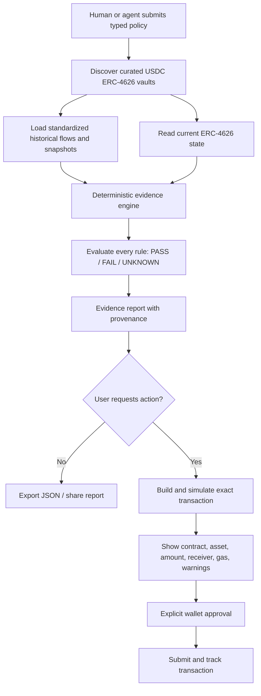

# TR4CE Product Requirements Document

**Status:** Build-ready product specification  
**Product:** TR4CE  
**Primary event:** ETHOnline 2026  
**Primary track:** The Graph — composable or standardized data products  
**Research cut-off:** 1 September 2026  
**Logo:** [`tr4ce-logo.png`](../tr4ce-logo.png)

## 1. Product decision

> **TR4CE gives people and agents reproducible evidence of what an ERC-4626 vault actually did, evaluates that evidence against an explicit policy, and prepares a transaction that the wallet owner must approve.**

TR4CE is an evidence and decision product, not a vault, yield aggregator, autonomous custodian, audit firm, or universal safety score.

The MVP compares USDC-denominated ERC-4626 vaults using one normalized data contract. Restricting the first comparison set to one underlying asset avoids pretending incomparable asset returns are directly equivalent and removes an unnecessary USD-pricing dependency.

## 2. Problem

A current or advertised APY does not answer the questions a depositor must resolve:

- Did vault share value increase over the selected historical window?
- Was the observation based on enough history and reproducible block data?
- What entered and left the vault during that period?
- Can this connected account withdraw or redeem the intended amount now?
- Does the result meet this user’s rules?
- Which source, block, schema, and calculation produced each claim?

Existing dashboards often collapse these questions into one headline number. Agents amplify the risk because a fluent answer can hide stale data, incompatible definitions, or unsupported assumptions.

## 3. Terminology correction

TR4CE MUST call the primary return metric **observed share-value return**, not “realized APY.”

For one whole share at block/time $t$:

$$
P_t = \operatorname{convertToAssets}(10^{d_s})
$$

where $d_s$ is the vault share-token decimals. For a lookback of $d$ days:

$$
r_d = \frac{P_t}{P_{t-d}} - 1
$$

The optional annualized display is:

$$
r_{annualized} = (1+r_d)^{365/d}-1
$$

This measures historical change in the ERC-4626 conversion value. It is not necessarily a user’s realized profit, does not include every user-specific fee or tax, may be distorted by donations or vault-specific accounting, and does not predict future return. The UI and machine response MUST carry those limitations.

## 4. Target users

### 4.1 Primary: treasury operator

Needs to compare a small allowlist of stablecoin vaults before proposing where idle USDC should be deposited. The operator needs evidence that can be reviewed by another signer.

### 4.2 Primary: agent developer

Needs a typed tool that returns evidence, uncertainty, and a prepared action without giving an agent unrestricted custody.

### 4.3 Secondary: DeFi researcher

Needs reproducible block-level snapshots and formulas rather than a screenshot of an APY.

### 4.4 Explicit non-user

A retail user seeking a guarantee that a vault is safe. TR4CE cannot provide that guarantee.

## 5. Jobs to be done

1. **Compare:** “Show me USDC vaults that satisfy my minimum history, TVL, return, and redemption-capacity rules.”
2. **Explain:** “Show the exact observations, formula, source, block, and caveats behind the result.”
3. **Decide:** “Return `PASS`, `FAIL`, or `UNKNOWN` for every rule; never convert missing data into a pass.”
4. **Act:** “Prepare and simulate a deposit or redemption, then require explicit wallet approval.”
5. **Audit:** “Let another human or agent reproduce the report later.”

## 6. Product principles

1. **Evidence before recommendation.** Rankings are derived from visible observations.
2. **Unknown fails closed.** Missing, stale, incompatible, or reverted evidence becomes `UNKNOWN` and cannot satisfy a policy.
3. **One as-of context.** A report identifies its chain, block, timestamp, schema version, and calculation version.
4. **No autonomous custody.** TR4CE prepares; the connected wallet approves.
5. **Capability-aware normalization.** Raw ERC-4626 results are preserved. Protocol-specific behavior is exposed, not silently repaired.
6. **Deterministic core.** LLMs may translate intent into a typed draft; they never calculate returns or override validation.
7. **Comparable first scope.** MVP vaults use USDC as the underlying asset.

## 7. End-to-end flow



## 8. MVP scope

### 8.1 Required

- One reusable ERC-4626 Substreams package or meaningful extension to a standardized package.
- Three to five verified USDC vaults spanning at least two protocols or supported networks.
- Historical `Deposit`, `Withdraw`, and share `Transfer` flows with canonical identifiers.
- Historical vault snapshots sufficient for 7-day and 30-day observed share-value return.
- Current ERC-4626 reads: `asset`, `totalAssets`, `totalSupply`, `convertToAssets`, `maxWithdraw`, `maxRedeem`, `previewDeposit`, and `previewRedeem`, recorded with raw outcomes.
- Typed five-rule policy.
- Human-readable evidence report and machine-readable JSON.
- MCP tools and a public `SKILL.md` describing correct agent use.
- One simulated deposit and one simulated redemption.
- At least one real or clearly labeled forked action with explicit wallet approval.
- Evaluation comparing a generic agent workflow against TR4CE’s typed tool.

### 8.2 Five MVP policy rules

Network selection is query context, not one of the five rules.

```json
{
  "version": 1,
  "underlyingAssets": ["USDC"],
  "minHistoryDays": 30,
  "minTvlAssets": "2000000000000",
  "minObservedReturnBps": {
    "windowDays": 7,
    "value": 0
  },
  "minWithdrawableAssets": {
    "owner": "0x1111111111111111111111111111111111111111",
    "value": "10000000000"
  }
}
```

Amounts are base-unit decimal strings. The policy compiler MUST reject floating-point amounts, unsupported keys, invalid addresses, impossible windows, and contradictory rules.

### 8.3 Rule semantics

| Rule | Pass | Fail | Unknown |
|---|---|---|---|
| Underlying asset | Canonical `asset()` is in the allowlist | Asset is outside allowlist | `asset()` reverts or asset identity cannot be verified |
| Minimum history | Valid observations cover the entire window | Vault age is shorter | Required blocks/snapshots are missing |
| Minimum TVL | `totalAssets` at the report block meets threshold | Below threshold | Current call/index is stale or reverted |
| Minimum observed return | Deterministic return meets threshold | Below threshold | Start/end observations are incompatible or absent |
| Minimum withdrawable assets | Raw, capability-aware evidence supports the amount | Supported value is below threshold | Method semantics are unsupported/ambiguous or call failed |

A protocol adapter MAY annotate known behavior, but MUST preserve the raw call and MUST NOT turn a documented non-standard zero into a fabricated positive value.

### 8.4 Out of scope

- Universal “safe/unsafe” scores.
- Smart-contract audit claims.
- Autonomous wallet custody or unattended deposits.
- A new vault protocol or token.
- Cross-chain transaction execution.
- Multi-asset performance comparison.
- Leverage, borrowing, routing, or yield optimization.
- Formal verification and historical VaR.

## 9. Functional requirements

### Discovery and identity

- **TR-F-001:** The system MUST identify a vault by `(chainId, vaultAddress)`.
- **TR-F-002:** The system MUST verify deployed bytecode, `asset()`, and required interface behavior before listing a vault.
- **TR-F-003:** Curated records MUST identify protocol and adapter version without replacing canonical onchain identity.
- **TR-F-004:** Unsupported vaults MUST be visible as unsupported with a reason, not silently omitted from diagnostics.

### Evidence

- **TR-F-010:** Every report MUST include report ID, schema version, calculation version, source, block number/hash, and generated timestamp.
- **TR-F-011:** Historical calculations MUST use deterministic integer or rational arithmetic; JavaScript `number` is forbidden for token amounts.
- **TR-F-012:** Start and end observations MUST refer to compatible vault implementations and canonical assets.
- **TR-F-013:** The engine MUST expose raw numerator, denominator, rounding direction, and formatted value.
- **TR-F-014:** The report MUST distinguish vault-wide net flows from share-value return.
- **TR-F-015:** Stale or missing data MUST produce `UNKNOWN` and a machine-readable reason code.
- **TR-F-016:** A report MUST be reproducible from its persisted observations without re-querying mutable “latest” endpoints.

### Policy

- **TR-F-020:** Policies MUST validate against a versioned JSON Schema.
- **TR-F-021:** Every rule MUST return status, observed value, threshold, evidence references, and reason codes.
- **TR-F-022:** Overall policy status MUST be `PASS` only when every required rule passes.
- **TR-F-023:** Natural-language input MAY produce a draft, but only the validated typed policy is executed.
- **TR-F-024:** The user MUST see the typed policy before saving or using it.

### Actions

- **TR-F-030:** Deposit preparation MUST show vault, asset, exact amount, receiver, approval requirement, previewed shares, and current block.
- **TR-F-031:** Redemption preparation MUST show shares, receiver, owner, previewed assets, limits, and current block.
- **TR-F-032:** Every action MUST be simulated against the selected chain before signature.
- **TR-F-033:** A simulation older than the configured block/time budget MUST be rerun before submission.
- **TR-F-034:** TR4CE MUST never request an unlimited token allowance in the MVP.
- **TR-F-035:** Chain, account, contract, and amount changes MUST invalidate the simulation.
- **TR-F-036:** The wallet owner MUST explicitly approve each state-changing transaction.

### Agent surface

- **TR-F-040:** MCP tools MUST expose versioned JSON responses and structured errors.
- **TR-F-041:** Initial tools: `search_vaults`, `get_evidence`, `evaluate_policy`, `prepare_deposit`, `prepare_redeem`, and `get_action_status`.
- **TR-F-042:** Read tools MUST be side-effect free.
- **TR-F-043:** Prepare tools MUST return unsigned transaction data; they MUST NOT submit transactions.
- **TR-F-044:** Every response MUST state evidence limitations and data freshness.

## 10. Evidence response contract

```json
{
  "schemaVersion": "1.0.0",
  "reportId": "trc_01...",
  "vault": {
    "chainId": 1,
    "address": "0x...",
    "asset": "0x...",
    "assetSymbol": "USDC"
  },
  "asOf": {
    "blockNumber": "24500123",
    "blockHash": "0x...",
    "timestamp": "2026-09-03T12:00:00Z"
  },
  "observations": {
    "shareValue": {
      "oneShareBaseUnits": "1000000000000000000",
      "assetsNow": "1052300",
      "assetsAtStart": "1041000",
      "windowDays": 30,
      "returnBps": 108
    },
    "totalAssets": "4200000000000",
    "netFlowAssets": "170000000000",
    "maxWithdrawAssets": "10000000000"
  },
  "policy": {
    "status": "PASS",
    "rules": []
  },
  "provenance": [],
  "limitations": [
    "Observed share-value return is backward-looking and is not a forecast."
  ]
}
```

The example shape is normative; the example values are illustrative.

## 11. Non-functional requirements

### Correctness

- Same observations and calculation version MUST produce byte-for-byte equivalent canonical result data.
- Token units MUST remain integers through indexing, storage, policy evaluation, and transaction preparation.
- Reorg handling MUST invalidate orphaned observations and dependent reports.

### Freshness

- Current-read evidence MUST show its block age.
- Default maximum age for transaction simulation: 3 blocks or 60 seconds, whichever occurs first.
- No fixed freshness threshold may be described as universally safe; it is an application operating limit.

### Performance

- Cached evidence report: p95 under 500 ms.
- Fresh current-state evidence for five vaults: p95 under 8 seconds under healthy providers.
- MCP read response: under 5 seconds when cached; otherwise return progress/error rather than hanging indefinitely.

### Security and privacy

- No private keys in TR4CE services.
- No seed phrases, private transaction data, or unnecessary personal data stored.
- Wallet addresses are pseudonymous identifiers and MUST be treated as user data.
- RPC, Graph, and database credentials remain server-side.
- Untrusted metadata and revert strings MUST be escaped before display or logging.

### Accessibility

- WCAG 2.2 AA contrast and keyboard operation for all critical flows.
- Status cannot be encoded by color alone.
- Tables require mobile card alternatives and semantic headings.

## 12. Success metrics

### Product

- A user can compare, inspect, and prepare an action without leaving the core flow.
- 100% of displayed numeric claims link to provenance.
- 0 policy passes from missing required evidence.
- 0 state-changing actions submitted without wallet confirmation.

### Hackathon

- Three to five real vaults successfully normalized.
- One composable package published with documentation and tests.
- One live provider query visible in the demo.
- One end-to-end simulated action plus one real/forked action.
- Agent evaluation shows higher evidence-field completeness and fewer unsupported claims than raw documentation/API access.

### Evaluation protocol

Use a fixed prompt set and fixed vault set. Compare:

| Metric | Definition |
|---|---|
| Schema completeness | Required fields returned / required fields total |
| Unsupported-claim rate | Claims without a source or calculation / all factual claims |
| Correct policy decision | Exact match to deterministic evaluator |
| Action validity | Prepared call simulates successfully at evaluation block |
| Median completion time | Start to valid evidence/action result |

Do not claim model improvement from one anecdotal run. Publish prompts, model, settings, provider, timestamp, and raw outputs.

## 13. Demo script

1. Enter: “Find USDC vaults with 30 days of history, at least 2m USDC TVL, non-negative 7-day observed share-value return, and enough withdrawable assets for this wallet.”
2. Show the typed policy and require confirmation.
3. Display three comparable vaults, including one `FAIL` or `UNKNOWN` result.
4. Open a report and trace one return value from formula to exact blocks and raw calls.
5. Show a capability warning where a vault’s limit method is non-standard or ambiguous.
6. Ask the MCP tool for the same report and show the typed response.
7. Prepare a small deposit or redemption, show the exact simulation, approve in wallet, and show the receipt.

## 14. Business model

- Open-source Substreams package, schema, calculation core, and basic MCP tools.
- Paid hosted history, alerting, report retention, and higher provider limits.
- Treasury policy packs, governance workflows, and audit exports.
- Embedded pre-trade evidence SDK for wallets and treasury platforms.

No token is required.

## 15. Release gates

TR4CE is not demo-ready until all gates pass:

1. Live standardized data is queryable from a public provider.
2. Every selected vault passes identity and capability verification.
3. At least three vaults are honestly comparable under one schema.
4. Historical block calculations reproduce within the documented rounding rules.
5. `UNKNOWN` propagates through policy decisions.
6. Deposit/redeem simulation works against the exact listed contract.
7. MCP and UI return the same report schema.
8. One action is completed or clearly labeled as forked.

If gates 1–3 fail, do not ship a hard-coded APY dashboard. Narrow to one protocol and demonstrate reusable evidence infrastructure honestly.

## 16. Related documents

- [Design system](./DESIGN-SYSTEMS.md)
- [Build plan](./BUILD-PLAN.md)
- [Architecture](./technical/ARCHITECTURE.md)
- [Integrations](./technical/INTEGRATIONS.md)
- [ERD](./technical/ERD.md)
- [Smart-contract interactions](./technical/SMART-CONTRACT.md)
- [Installation](./technical/INSTALLATION.md)
- [Tech stack](./technical/TECH-STACK.md)
- [Agent context](../CONTEXT.md)

## 17. Primary sources

- [ETHOnline 2026 event](https://ethglobal.com/events/ethonline2026)
- [ETHOnline 2026 prizes](https://ethglobal.com/events/ethonline2026/prizes)
- [ERC-4626 specification](https://eips.ethereum.org/EIPS/eip-4626)
- [The Graph: Agent Skills for Substreams](https://thegraph.com/docs/en/substreams/tooling/skills/)
- [The Graph AI overview](https://thegraph.com/docs/en/ai-overview/)
- [The Graph Subgraph MCP](https://thegraph.com/docs/en/subgraphs/tooling/subgraph-mcp/introduction/)
- [The Graph standardized Subgraphs](https://thegraph.com/docs/en/subgraphs/existing-subgraphs/standard-subgraphs/)
- [Substreams EVM contract calls](https://docs.substreams.dev/tutorials/eth-calls)
- [Morpho Vaults and ERC-4626 mechanics](https://docs.morpho.org/developers/earn/concepts/vault-mechanics/)
- [Morpho vault asset flows and limit-method caveat](https://docs.morpho.org/developers/earn/tutorials/assets-flow/)
