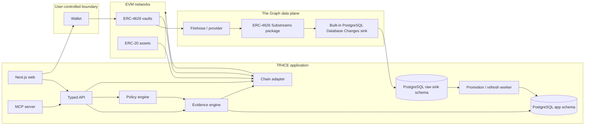
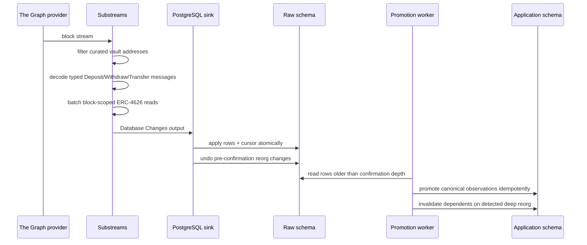
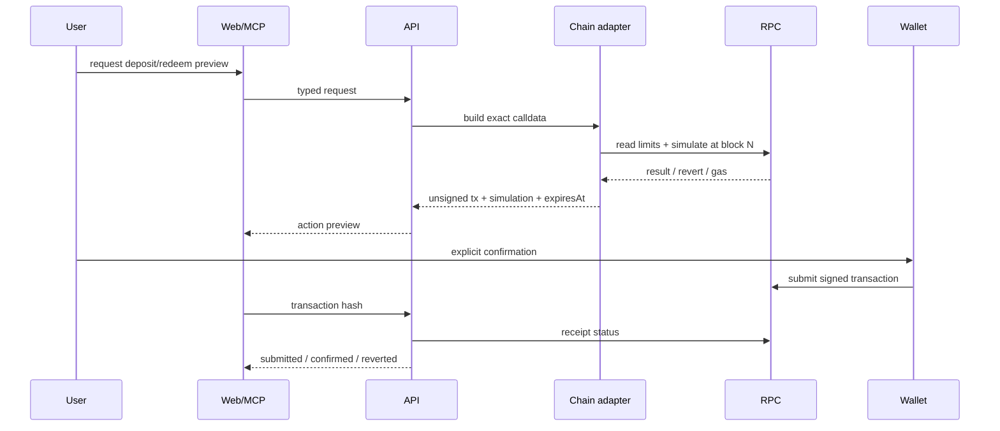
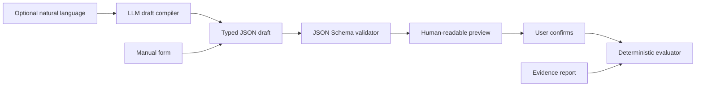

# TR4CE Architecture

**Architecture style:** evidence pipeline with deterministic decision core  
**Custody model:** non-custodial; services never hold user signing keys  
**Canonical requirements:** [PRD](../PRD.md)

## 1. System boundary

TR4CE owns:

- normalized vault identity and capabilities;
- reusable ERC-4626 historical indexing;
- deterministic evidence calculations;
- policy validation and evaluation;
- report provenance;
- unsigned action preparation and simulation;
- web and MCP presentation.

TR4CE does not own vault contracts, asset contracts, chain finality, wallet signing, or the historical truth emitted by upstream chains. Those are explicit external trust boundaries.

## 2. Container architecture



## 3. Deployable units

| Unit | Responsibility | Does not do |
|---|---|---|
| `apps/web` | Read-only discovery, policy editing, evidence UI, wallet approval | Index historical chain data |
| `apps/api` | Versioned HTTP boundary, auth/rate limits, orchestration | Financial arithmetic in controllers |
| `apps/mcp` | Typed agent tools mapped to the same application services | Submit transactions or retain private keys |
| `apps/worker` | Promote confirmed sink rows, refresh current evidence, detect deep reorgs | Make policy decisions with an LLM |
| `packages/evidence` | Pure calculations, reason codes, report assembly | Network/database access |
| `packages/policy` | JSON Schema, compiler, deterministic evaluator | Free-form execution |
| `packages/chain` | ERC-4626 reads, calldata, simulation, receipt parsing | Historical aggregation |
| `packages/db` | Schema, queries, migrations, unit-safe persistence | Business decisions |
| `substreams/erc4626` | Decode standardized flows and block-scoped snapshots | User/account-specific current reads |

The web, API, MCP, and worker MAY run in one process during local development. Their code boundaries remain separate so the hackathon deployment can split the worker without rewriting business logic.

## 4. Core data flow

### 4.1 Historical ingestion



Canonical event key: `(chain_id, block_hash, transaction_hash, log_index)`. Never deduplicate on transaction hash alone.

The built-in sink owns raw cursor/undo semantics. The worker never promotes unconfirmed rows. Replaying promotion yields the same application keys; a deep reorg detected after promotion marks affected observations non-canonical and invalidates dependent reports.

### 4.2 Evidence generation

1. Resolve `(chainId, vaultAddress)` and capability profile.
2. Select an `asOfBlock` at or below the configured confirmation depth.
3. Find historical start observation by timestamp/window policy; retain actual elapsed seconds.
4. Read or retrieve current `totalAssets`, `totalSupply`, `convertToAssets`, and limit/preview methods at `asOfBlock`.
5. Reject incompatible asset, implementation, decimals, or schema transitions unless an adapter explicitly models them.
6. Run pure calculations with integer/rational arithmetic.
7. Evaluate all five rules as `PASS`, `FAIL`, or `UNKNOWN`.
8. Persist immutable report inputs, outputs, versions, and evidence links.

### 4.3 Action preparation



The API cannot sign. MCP prepare tools cannot submit. Wallet state changes invalidate cached simulation.

## 5. Deterministic evidence engine

The engine accepts data, not providers:

```ts
type EvidenceInput = {
  vault: VaultIdentity;
  asOf: BlockRef;
  start: VaultSnapshot | null;
  end: VaultSnapshot;
  accountLimits: AccountLimitObservation | null;
  flows: FlowAggregate;
  capability: VaultCapability;
  calculationVersion: string;
};

function buildEvidence(input: EvidenceInput): EvidenceReport;
```

### Numeric rules

- Token amounts: `bigint` in application memory, decimal strings at JSON boundaries, `numeric(78,0)` or text in PostgreSQL.
- Ratios: numerator and denominator retained; format only at presentation.
- Basis points: signed integer after explicit rounding.
- Annualization: high-precision decimal library isolated inside `packages/evidence`; never native floating point for policy decisions.
- Denominator `0`, missing observation, revert, stale data, or incompatible decimals returns `UNKNOWN` reason; never a guessed zero.

### Report immutability

A report references immutable observations and version strings. Refresh creates a new report. It never mutates the old calculation under the same report ID.

## 6. Policy architecture



The LLM boundary is untrusted. Unknown keys, invalid units, or unsupported semantics are rejected. The canonical policy is validated JSON stored with a schema version.

Overall policy status truth table:

- any `FAIL` → `FAIL`;
- otherwise any required `UNKNOWN` → `UNKNOWN`;
- all `PASS` → `PASS`.

## 7. Capability model

ERC-4626 standardizes interfaces, but deployed semantics and protocol extensions differ. Every listed vault receives a capability profile:

```ts
type CapabilityStatus = "supported" | "nonstandard" | "reverts" | "unknown";

type VaultCapability = {
  adapter: "erc4626" | "morpho-v2" | "yearn-v3";
  adapterVersion: string;
  maxWithdraw: CapabilityStatus;
  maxRedeem: CapabilityStatus;
  previewDeposit: CapabilityStatus;
  previewRedeem: CapabilityStatus;
  notes: string[];
};
```

Adapters may explain known protocol behavior. They may not fabricate a value that the contract did not produce. Raw observations and adapter interpretation are both persisted.

## 8. Freshness and consistency

Three clocks are distinct:

1. **Indexed history head** — latest canonical block in the data plane.
2. **RPC head** — latest block available to current calls.
3. **Action simulation block** — exact block used for transaction preview.

A report chooses one `asOfBlock <= min(indexedHead, confirmedRpcHead)`. Current account-specific reads for a prepared action can be newer, but are labeled separately and cannot silently replace the report block.

Default action freshness: 3 blocks or 60 seconds. This is an operational limit, not a safety guarantee.

## 9. Failure behavior

| Failure | System behavior |
|---|---|
| Graph provider unavailable | Serve immutable cached reports with stale label; block claims requiring fresh history |
| RPC unavailable | Historical report may remain readable; current limits and action preparation become `UNKNOWN`/unavailable |
| Contract read reverts | Persist raw failure classification; affected rule becomes `UNKNOWN` |
| Schema mismatch | Reject payload, alert operator, preserve cursor before invalid batch |
| Reorg | Mark orphaned rows, rewind, invalidate reports/actions using orphaned block |
| Simulation reverts | Display decoded reason where safe; action remains un-signable through TR4CE |
| Wallet changes chain/account | Clear action state and rerun reads/simulation |
| LLM returns invalid policy | Show validation errors; no evaluator/action call |

## 10. Security boundaries

### Trusted for deterministic behavior

- versioned evidence and policy code;
- verified contract bytecode/address configuration;
- canonical chain data at identified blocks;
- persisted raw observations.

### Untrusted inputs

- natural language;
- token/vault metadata strings;
- public RPC/Graph responses until validated;
- wallet-provided account/network state;
- contract revert data;
- API callers and MCP clients.

### Controls

- allowlisted chain IDs and curated vault identities for MVP;
- exact ABI decoding and runtime schema validation;
- server-side secrets only;
- per-tool and per-IP rate limits;
- content escaping and bounded logs;
- CSP, CSRF protection for stateful web routes, secure cookies if accounts are added;
- no private-key ingestion;
- exact-amount allowances only;
- simulation and explicit signature.

## 11. Observability

Structured log fields: `requestId`, `reportId`, `actionId`, `chainId`, `vaultAddress`, `blockNumber`, `schemaVersion`, `calculationVersion`, `provider`, `durationMs`, and `reasonCode`.

Metrics:

- indexer lag and reorg count;
- observation call success/revert rate by vault/method;
- report generation duration;
- policy status counts by reason code;
- simulation success/revert/stale counts;
- MCP tool latency and structured-error rate;
- evaluation schema completeness and unsupported-claim rate.

Never log raw natural-language prompts if they can contain wallet or treasury-sensitive information without explicit consent.

## 12. Scaling path

MVP uses one PostgreSQL database and one worker. Add components only when measured:

- queue when refresh jobs contend or need retries across processes;
- read replica when evidence reads saturate the primary;
- object storage when immutable raw evaluation artifacts become large;
- additional asset pricing only when multi-asset comparison is approved;
- additional adapters only after a vault fails honest generic normalization.

No Kafka, microservice mesh, custom blockchain, or proprietary oracle is required.

## 13. Architecture acceptance checks

- Replaying the same block batch changes no canonical row.
- A synthetic reorg invalidates every dependent report and action.
- The same report input through HTTP and MCP yields the same canonical JSON.
- Missing historical observation produces `UNKNOWN` and blocks policy pass.
- A non-standard `maxWithdraw` response remains visible and is not reinterpreted as verified liquidity.
- Services contain no transaction signing path.
- Changing account, chain, amount, or block invalidates action simulation.
