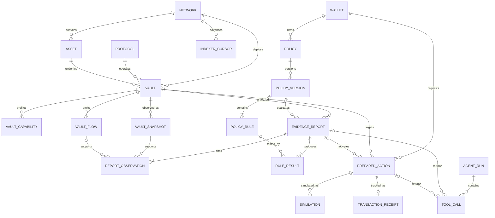

# TR4CE Entity Relationship Model

**Database:** PostgreSQL  
**Numeric invariant:** Token amounts are integer base units; never floating point.  
**Identity invariant:** Every onchain entity includes `chain_id`.

## 1. Model overview

TR4CE separates four kinds of truth:

1. **Registry:** curated identity and capability metadata.
2. **Observed chain data:** immutable events and block-scoped snapshots.
3. **Derived evidence:** versioned calculations and policy decisions.
4. **User action state:** unsigned preparation, simulation, and receipt tracking.

Derived rows always reference their observations. A current upstream response never overwrites historical evidence.

### 1.1 Raw sink staging

The built-in PostgreSQL Database Changes sink owns a separate `raw_erc4626` schema with one typed table per protobuf event (`deposit`, `withdraw`, `share_transfer`), `vault_snapshot`, and the sink-managed `cursors` table. Raw event primary keys use chain/block hash/transaction/log identity; snapshot keys use vault/block hash/schema version. The sink may insert, update, or delete these rows during pre-confirmation reorg handling.

Application reports never reference raw staging rows. The promotion worker copies only rows at or below the confirmed head into the constrained tables below. This keeps sink undo operations independent from report foreign keys while retaining a deep-reorg invalidation path.

## 2. ERD

## 3. Registry tables

### `network`

| Column | Type | Constraint / meaning |
|---|---|---|
| `chain_id` | `bigint` | PK; EIP-155 chain ID |
| `slug` | `text` | UNIQUE; stable internal name |
| `name` | `text` | Display name |
| `native_symbol` | `text` | Display only |
| `confirmation_depth` | `integer` | `>= 0`; operational finality setting |
| `enabled` | `boolean` | Listing switch |
| `created_at` | `timestamptz` | Audit timestamp |
| `updated_at` | `timestamptz` | Audit timestamp |

RPC URLs and credentials do not belong in this table; store provider configuration in server secrets.

### `protocol`

| Column | Type | Constraint / meaning |
|---|---|---|
| `id` | `uuid` | PK |
| `slug` | `text` | UNIQUE, e.g. `morpho-v2` |
| `name` | `text` | Display name |
| `adapter_key` | `text` | Code-owned adapter discriminator |
| `documentation_url` | `text` | Official source |

### `asset`

| Column | Type | Constraint / meaning |
|---|---|---|
| `id` | `uuid` | PK |
| `chain_id` | `bigint` | FK `network` |
| `address` | `bytea` | 20 bytes |
| `symbol` | `text` | Untrusted/display metadata |
| `name` | `text` | Untrusted/display metadata |
| `decimals` | `smallint` | `0..255` |
| `canonical_key` | `text` | Curated identity, e.g. `USDC` |
| `verified_at_block` | `numeric(78,0)` | Exact block |
| `code_hash` | `bytea` | Deployment identity aid |

UNIQUE `(chain_id, address)`. Addresses are serialized as checksummed hex only at application boundaries.

### `vault`

| Column | Type | Constraint / meaning |
|---|---|---|
| `id` | `uuid` | PK |
| `chain_id` | `bigint` | FK `network` |
| `address` | `bytea` | 20 bytes |
| `protocol_id` | `uuid` | FK `protocol` |
| `asset_id` | `uuid` | FK `asset` |
| `share_decimals` | `smallint` | Whole-share conversion scale |
| `name` | `text` | Escaped display metadata |
| `symbol` | `text` | Escaped display metadata |
| `deployment_block` | `numeric(78,0)` | Nullable only while discovery incomplete |
| `code_hash` | `bytea` | Verified deployed bytecode hash |
| `status` | `text` | `candidate/listed/degraded/unsupported` |
| `status_reason` | `text` | Machine-readable reason key |
| `verified_at` | `timestamptz` | Onboarding timestamp |

UNIQUE `(chain_id, address)`.

### `vault_capability`

Append-only profiles; do not mutate the interpretation used by old reports.

| Column | Type | Meaning |
|---|---|---|
| `id` | `uuid` | PK |
| `vault_id` | `uuid` | FK `vault` |
| `adapter_key` | `text` | Exact code adapter |
| `adapter_version` | `text` | Semver/hash |
| `implementation_address` | `bytea` | Nullable for non-proxy |
| `implementation_code_hash` | `bytea` | Bytecode identity |
| `capabilities` | `jsonb` | Validated capability JSON |
| `effective_from_block` | `numeric(78,0)` | Inclusive |
| `effective_to_block` | `numeric(78,0)` | Nullable, exclusive |
| `verified_at` | `timestamptz` | Audit timestamp |

A partial unique index permits one open profile per vault.

## 4. Observed onchain data

### `vault_flow`

| Column | Type | Meaning |
|---|---|---|
| `id` | `uuid` | PK |
| `vault_id` | `uuid` | FK |
| `chain_id` | `bigint` | Denormalized integrity/query key |
| `block_number` | `numeric(78,0)` | Exact block |
| `block_hash` | `bytea` | Canonicality key |
| `block_time` | `timestamptz` | Chain timestamp |
| `transaction_hash` | `bytea` | 32 bytes |
| `log_index` | `integer` | Event position |
| `kind` | `text` | `deposit/withdraw/share_transfer` |
| `sender` | `bytea` | Nullable only when unavailable |
| `owner` | `bytea` | Nullable by event kind |
| `receiver` | `bytea` | Nullable by event kind |
| `assets` | `numeric(78,0)` | Nullable by event kind |
| `shares` | `numeric(78,0)` | Exact integer |
| `canonical` | `boolean` | Reorg state |
| `schema_version` | `text` | Producer schema |

UNIQUE `(chain_id, block_hash, transaction_hash, log_index, kind)`. CHECK amounts are non-negative.

### `vault_snapshot`

| Column | Type | Meaning |
|---|---|---|
| `id` | `uuid` | PK |
| `vault_id` | `uuid` | FK |
| `capability_id` | `uuid` | FK profile used |
| `block_number` | `numeric(78,0)` | Exact block |
| `block_hash` | `bytea` | Exact hash |
| `block_time` | `timestamptz` | Chain timestamp |
| `total_assets` | `numeric(78,0)` | Raw call result |
| `total_supply` | `numeric(78,0)` | Raw call result |
| `one_share_units` | `numeric(78,0)` | Usually `10^share_decimals` |
| `one_share_assets` | `numeric(78,0)` | `convertToAssets` result |
| `call_status` | `text` | `ok/partial/reverted` |
| `call_errors` | `jsonb` | Validated per-method failures |
| `canonical` | `boolean` | Reorg state |
| `schema_version` | `text` | Producer schema |
| `observed_at` | `timestamptz` | Ingestion time |

UNIQUE `(vault_id, block_hash, schema_version)`.

Account-specific current limits are not placed in the vault-wide snapshot.

### `indexer_cursor`

This is the application **promotion cursor**, separate from the built-in sink’s `raw_erc4626.cursors` table.

| Column | Type | Meaning |
|---|---|---|
| `chain_id` | `bigint` | PK component |
| `stream_key` | `text` | PK component |
| `block_number` | `numeric(78,0)` | Last committed block |
| `block_hash` | `bytea` | Canonical hash |
| `schema_version` | `text` | Consumer contract |
| `updated_at` | `timestamptz` | Liveness |

## 5. User policy

### `wallet`

| Column | Type | Meaning |
|---|---|---|
| `id` | `uuid` | PK |
| `chain_scope` | `text` | Optional UI preference, not identity |
| `address` | `bytea` | 20 bytes |
| `created_at` | `timestamptz` | First seen |

UNIQUE `address`. No private key or unnecessary profile data.

### `policy`

Stable logical policy: `id`, `wallet_id`, `name`, `created_at`, `archived_at`.

### `policy_version`

| Column | Type | Meaning |
|---|---|---|
| `id` | `uuid` | PK |
| `policy_id` | `uuid` | FK |
| `version_number` | `integer` | Monotonic per policy |
| `schema_version` | `text` | JSON Schema version |
| `canonical_json` | `jsonb` | Validated typed policy |
| `content_hash` | `bytea` | Canonical JSON hash |
| `source` | `text` | `manual/llm_import` |
| `confirmed_at` | `timestamptz` | User confirmation |

UNIQUE `(policy_id, version_number)` and `(policy_id, content_hash)`.

### `policy_rule`

Normalized rule rows for query/audit: `id`, `policy_version_id`, `rule_key`, `operator`, `value_json`, `ordinal`. The canonical policy remains `policy_version.canonical_json`; normalized rows must match it in the same transaction.

## 6. Derived evidence

### `evidence_report`

| Column | Type | Meaning |
|---|---|---|
| `id` | `text` | PK, sortable generated ID |
| `vault_id` | `uuid` | FK |
| `policy_version_id` | `uuid` | Nullable for evidence-only report |
| `as_of_block_number` | `numeric(78,0)` | Report context |
| `as_of_block_hash` | `bytea` | Exact block |
| `as_of_time` | `timestamptz` | Chain time |
| `window_seconds` | `bigint` | Actual requested window |
| `actual_elapsed_seconds` | `bigint` | Exact observation spacing |
| `calculation_version` | `text` | Pure engine version |
| `schema_version` | `text` | Response version |
| `status` | `text` | `pass/fail/unknown/not_evaluated` |
| `result_json` | `jsonb` | Immutable validated response |
| `canonical_input_hash` | `bytea` | Dedup/reproducibility |
| `invalidated_at` | `timestamptz` | Reorg/identity change |
| `invalidation_reason` | `text` | Reason key |
| `created_at` | `timestamptz` | Generation time |

A unique index on `(canonical_input_hash, calculation_version, schema_version)` prevents duplicate equivalent reports.

### `report_observation`

Links report to exact source:

- `report_id`;
- `observation_type` (`snapshot`, `flow`, `rpc_call`);
- `snapshot_id` nullable;
- `flow_id` nullable;
- `rpc_observation_id` nullable;
- `purpose` (`start`, `end`, `net_flow`, `account_limit`, `simulation_input`);
- `ordinal`.

CHECK exactly one observation FK is populated.

### `rpc_observation`

Stores current/account-specific call evidence: chain, contract, method selector, args hash, block, raw return/revert classification, decoded validated JSON, provider key, and observed timestamp. It MUST NOT store provider credentials.

### `rule_result`

| Column | Type | Meaning |
|---|---|---|
| `id` | `uuid` | PK |
| `report_id` | `text` | FK |
| `policy_rule_id` | `uuid` | FK |
| `status` | `text` | `pass/fail/unknown` |
| `observed_json` | `jsonb` | Typed observed value |
| `threshold_json` | `jsonb` | Typed threshold |
| `reason_codes` | `text[]` | Stable machine reasons |
| `evidence_refs` | `uuid[]` | Report observation IDs |

## 7. Action tables

### `prepared_action`

| Column | Type | Meaning |
|---|---|---|
| `id` | `text` | PK |
| `wallet_id` | `uuid` | Requesting wallet |
| `vault_id` | `uuid` | Target |
| `report_id` | `text` | Nullable motivation |
| `kind` | `text` | `deposit/redeem` |
| `chain_id` | `bigint` | Signed context |
| `account` | `bytea` | Sender |
| `calldata_hash` | `bytea` | Immutable action identity |
| `transactions_json` | `jsonb` | Unsigned exact calls |
| `status` | `text` | `prepared/simulated/submitted/confirmed/reverted/expired/invalidated` |
| `expires_at` | `timestamptz` | Time limit |
| `created_at` | `timestamptz` | Audit timestamp |
| `invalidated_reason` | `text` | Nullable reason key |

No signature is stored.

### `simulation`

Append-only attempts: `id`, `prepared_action_id`, `block_number`, `block_hash`, `account`, `success`, `gas_estimate`, `return_data_hash`, `decoded_result_json`, `revert_class`, `provider_key`, `created_at`.

### `transaction_receipt`

`prepared_action_id` UNIQUE, `chain_id`, `transaction_hash`, `submitted_at`, `confirmed_block_number`, `confirmed_block_hash`, `status`, `gas_used`, `effective_gas_price`, `observed_at`.

## 8. Agent evaluation tables

- `agent_run`: experiment ID, variant (`baseline/tr4ce`), prompt-set version, model, settings hash, environment, started/completed timestamps.
- `tool_call`: run ID, tool name/version, request hash, response schema version, success/error class, duration, optional report/action FK. Raw prompts/outputs belong in access-controlled artifacts only when consent and retention policy permit.

## 9. Units and serialization

| Value | Database | TypeScript/API |
|---|---|---|
| Token amount | `numeric(78,0)` | `bigint` internally, decimal string in JSON |
| Block number | `numeric(78,0)` | `bigint` / decimal string |
| Address/hash | `bytea` | validated `0x` hex |
| Basis points | `integer` | integer |
| Ratio | numerator + denominator | bigint pair |
| Timestamp | `timestamptz` | ISO-8601 UTC string |

PostgreSQL `numeric` values are decoded as strings. Do not coerce them into JavaScript `number`.

## 10. Retention and privacy

- Canonical chain observations and immutable reports: retain while product supports reproduction.
- Orphaned observations: retain with `canonical=false` for reorg audit, subject to storage policy.
- Simulations and receipts: retain for user-visible history.
- Wallet addresses: delete/anonymize user-level associations on request where compatible with immutable public-chain facts.
- Natural-language prompts: off by default; if evaluation requires them, store separately with a declared retention window.
- Secrets/private keys/signatures: never persist.

## 11. Critical constraints

- Foreign keys prevent report observations from referencing another vault/chain through application bugs; add composite integrity checks in migrations.
- A report cannot reference non-canonical observations at creation time.
- Invalidation is append/audit state, not destructive deletion.
- Capability and calculation versions are immutable once referenced.
- All enum-like text columns have database CHECK constraints generated from shared schema values.
